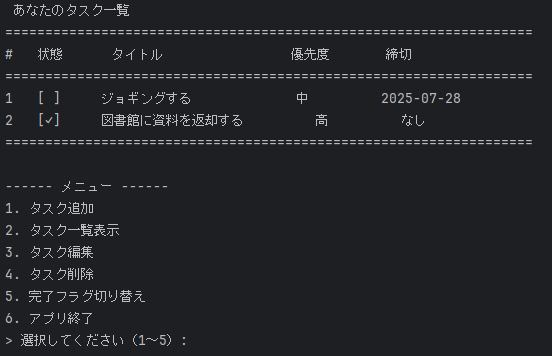

# 📝 CLI ToDoアプリ（Java）

---

## 📸 スクリーンショット


---

## 📌 概要

- Javaで作成したシンプルなCLIベースのToDoアプリです。
- **タスク追加・一覧表示・削除・完了状態の切替** など基本的な機能を備えています。
- UTF-8対応（IntelliJ IDEAで実行推奨）。

---

## ⚠ Windowsコンソールでの文字化けについて

- **PowerShell / cmd ではUTF-8の日本語出力が文字化けする場合があります。**
- 回避方法：
    - **IntelliJ IDEAのRunコンソール**で実行する。
    - または **Windows Terminal + UTF-8フォント（Cascadia Code PLなど）** を使用する。
    - 最低限、以下を実行してUTF-8コードページに切り替えることで改善することもあります：

      ```powershell
      chcp 65001
      java -Dfile.encoding=UTF-8 task.TodoApp
      ```

---

## 🚀 機能一覧

1. **タスク追加**
    - タイトル、優先度（高/中/低）、期限日を指定して追加。
2. **タスク一覧表示**
    - 完了状態 `[✓]` または `[ ]` を表示。
3. **タスク編集**
    - 指定した番号のタスクを編集。
4. **タスク削除**
    - 指定した番号のタスクを削除。
5. **完了フラグ切り替え**
    - 指定タスクの完了⇔未完了を切り替え。
6. **永続化**
    - `task.txt` にUTF-8で保存・読み込み。

---

## 🛠 開発環境

- **Java:** 17（またはそれ以上）
- **ビルド:** `javac` / `java` コマンド利用
- **テスト:** JUnit 5

---

## ▶ 実行方法

1. クローン：

    ```bash
    git clone https://github.com/thingmeurl/java-cli-todo-app.git
    cd java-cli-todo-app
    ```

2. コンパイル & 実行：

    ```bash
    javac -encoding UTF-8 task/*.java
    java -Dfile.encoding=UTF-8 task.TodoApp
    ```

---
## 🚦 優先度（Priority）機能の導入（2025-07）

本アプリでは、タスクの重要度を表すために `Priority` 列挙型（enum）を導入しました。これにより、可読性・保守性が向上し、後続の機能追加にも柔軟に対応できるようになります。

### 📌 実装背景

従来は優先度を `String` 型（例："高", "中", "低"）で扱っていましたが、以下のような課題がありました：

- 入力ミスに弱く、誤った文字列が混入する可能性がある
- 比較や分岐処理のたびに文字列と照合が必要で冗長
- 値の意味がコード上で曖昧

これらを解消するため、列挙型 `Priority` を導入しました。

```java
public enum Priority {
    HIGH,
    MEDIUM,
    LOW;

    public static Priority fromString(String value) {
        switch (value) {
            case "高": return HIGH;
            case "中": return MEDIUM;
            case "低": return LOW;
            default: throw new IllegalArgumentException("無効な優先度: " + value);
        }
    }

    public String toLocalizedString() {
        switch (this) {
            case HIGH: return "高";
            case MEDIUM: return "中";
            case LOW: return "低";
            default: return "";
        }
    }
}
```
---

## 🔧 Maven対応（2025-07）

このプロジェクトは **Maven** によるビルド管理に対応しています。

### 📁 プロジェクト構成（標準的なMavenレイアウト）

```
src/
  main/
    java/
      task/
        Task.java
        TaskManager.java
        TodoApp.java
  test/
    java/
      task/
        TaskTest.java
        TaskManagerTest.java
pom.xml
```

### 🧪 ビルド & テスト

- コンパイル：

    ```bash
    mvn clean compile
    ```

- テスト実行（JUnit 5）：

    ```bash
    mvn test
    ```

- 実行（maven-exec-plugin の設定が必要）：

    ```bash
    mvn exec:java -Dexec.mainClass="task.TodoApp"
    ```

---

## 💡 今後の改善予定

- Mavenプラグインによる `exec` 設定を追加。
- タスク編集機能の追加。
- ファイルI/O部分を `TaskRepository` クラスとして分離。
- Web対応版（Spring Boot等）への拡張。
